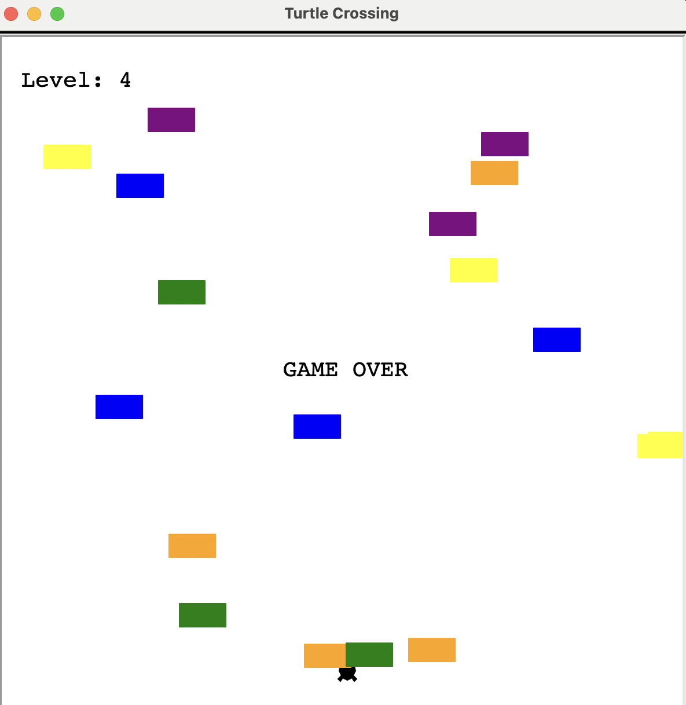

# Turtle Crossing Game 🐢🚗

A Python arcade-style game inspired by the classic Frogger, built using the `turtle` graphics module.  
The player controls a turtle that must safely cross a busy road while avoiding oncoming cars. Each successful crossing increases the difficulty.

---

## Gameplay
- Use the **Up Arrow key** to move the turtle upward
- Avoid the cars moving across the screen
- Each time the turtle reaches the top, the **level increases**
- With each level, the cars move faster
- The game ends when the turtle collides with a car

---

## Preview



## Technologies
- **Python 3**
- **turtle** (standard Python graphics library)
- Object-Oriented Programming (OOP)

---

## 📁 Project Structure
turtle-crossing-game/
│
├── main.py # Main game loop
├── animal.py # Player (turtle) class
├── car.py # Car manager and car logic
├── scoreboard.py # Score and level display
└── README.md

---

## ▶️ How to Run
1. Make sure you have **Python 3** installed
2. Clone the repository:
   ```bash
   git clone https://github.com/your-username/turtle-crossing-game.git

3. Run the game:
python main.py
